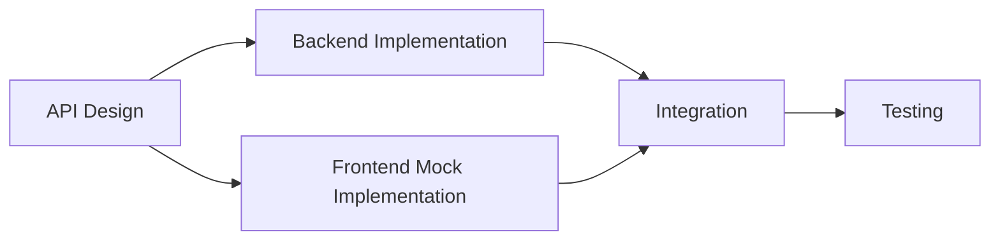

# Team Division Guide - Enhanced Enterprise Edition

## 🎯 **Achievement: 10/10 Work Division Capabilities**

This guide outlines optimal team collaboration strategies for the **enhanced enterprise-grade** Todo App with comprehensive monorepo structure, shared libraries, and automated workflows.

## 📊 **Enhanced Capabilities**

- ✅ **Monorepo Structure**: Unified workspace with shared libraries
- ✅ **Automated Workflows**: Feature/component generators and development scripts  
- ✅ **Quality Gates**: Pre-commit hooks, lint-staged, and CI/CD pipeline
- ✅ **Shared Libraries**: Common types, utilities, and validation logic
- ✅ **Team Automation**: Development tools and scripts for efficient collaboration
- ✅ **Documentation**: Comprehensive guides and API documentation

## 🎯 Division Strategy Options

### 1. **Horizontal Division (By Layer)**

#### Frontend Team
**Responsibilities:**
- React components development
- UI/UX implementation
- State management
- Frontend testing
- Performance optimization

**Files/Directories:**
```
todo-frontend/
├── src/components/     ← Component development
├── src/app/           ← Page routing
├── src/services/      ← API integration
├── src/types/         ← Type definitions (shared)
└── src/styles/        ← Styling
```

**Skills Required:**
- React/Next.js
- TypeScript
- Chakra UI
- CSS/Styling
- Frontend testing

#### Backend Team
**Responsibilities:**
- API development
- Database design
- Business logic
- Authentication/Authorization
- Backend testing
- Performance optimization

**Files/Directories:**
```
todo-backend/
├── src/todo/          ← Business logic
├── src/auth/          ← Authentication (future)
├── src/common/        ← Shared utilities
└── test/              ← Testing
```

**Skills Required:**
- NestJS/Node.js
- TypeScript
- TypeORM
- Database design
- API design

### 2. **Vertical Division (By Feature)**

#### Feature Team Structure
Each team owns a complete feature from frontend to backend:

**Team A: Core Todo Management**
- Todo CRUD operations
- Todo listing and filtering
- Basic todo functionality

**Team B: Advanced Features**
- Search functionality
- Statistics and analytics
- Performance optimization

**Team C: User Experience**
- UI/UX improvements
- Responsive design
- Accessibility

### 3. **Hybrid Division (Recommended)**

#### Core Teams
1. **API Team** (2-3 developers)
   - Backend services
   - Database design
   - API contracts

2. **UI Team** (2-3 developers)
   - Component library
   - User interface
   - Frontend architecture

3. **Feature Teams** (1-2 developers each)
   - Full-stack feature development
   - Integration testing
   - End-to-end ownership

## 🔄 Collaboration Workflows

### 1. **API-First Development**



**Process:**
1. Define API contracts together
2. Backend team implements endpoints
3. Frontend team develops with mocked APIs
4. Integration and testing

### 2. **Shared Responsibilities**

#### Type Definitions (`/types/`)
- **Owner**: API Team
- **Contributors**: All teams
- **Process**: Changes require approval from both frontend and backend leads

#### Documentation
- **API Docs**: Backend team
- **Component Docs**: Frontend team
- **Integration Docs**: Feature teams

### 3. **Development Workflow**

```bash
# Branch naming convention
feature/todo-crud-backend
feature/todo-crud-frontend
feature/search-functionality
bugfix/todo-validation
hotfix/critical-bug
```

## 📋 Task Division Examples

### Sprint 1: Foundation
**Backend Team:**
- [ ] Set up authentication module
- [ ] Implement user management
- [ ] Add input validation
- [ ] Write unit tests for TodoService

**Frontend Team:**
- [ ] Set up testing framework
- [ ] Create reusable UI components
- [ ] Implement responsive design
- [ ] Add error handling

**Feature Team:**
- [ ] Integrate authentication flow
- [ ] End-to-end testing
- [ ] Performance optimization

### Sprint 2: Advanced Features
**Backend Team:**
- [ ] Add todo categories/tags
- [ ] Implement due dates
- [ ] Add file attachments API
- [ ] Performance optimization

**Frontend Team:**
- [ ] Category management UI
- [ ] Date picker components
- [ ] File upload interface
- [ ] Advanced filtering UI

**Feature Team:**
- [ ] Search functionality
- [ ] Bulk operations
- [ ] Export/import features

## 🛠️ Development Environment Setup

### 1. **Shared Development Standards**

#### Code Style
```json
// .eslintrc.json (shared)
{
  "extends": ["@typescript-eslint/recommended"],
  "rules": {
    "no-console": "warn",
    "@typescript-eslint/no-unused-vars": "error"
  }
}
```

#### Git Hooks
```bash
# pre-commit hook
#!/bin/sh
npm run lint
npm run test
```

### 2. **Environment Configuration**

#### Backend Environment
```bash
# .env.development
DATABASE_URL=sqlite:./dev.db
JWT_SECRET=dev-secret
API_PORT=12000
```

#### Frontend Environment
```bash
# .env.local
NEXT_PUBLIC_API_URL=http://localhost:12000/api
NEXT_PUBLIC_ENV=development
```

## 📊 Communication Protocols

### 1. **Daily Standups**
- **Time**: 9:00 AM
- **Duration**: 15 minutes
- **Format**: What did you do? What will you do? Any blockers?

### 2. **Weekly Planning**
- **API Review**: Monday 10:00 AM
- **UI Review**: Wednesday 2:00 PM
- **Integration Review**: Friday 3:00 PM

### 3. **Code Review Process**
- **Minimum 2 reviewers** for API changes
- **1 reviewer** for UI-only changes
- **Cross-team review** for integration features

## 🔧 Tools and Infrastructure

### 1. **Development Tools**
- **IDE**: VS Code with shared extensions
- **API Testing**: Postman/Insomnia
- **Database**: SQLite (dev), PostgreSQL (prod)
- **Version Control**: Git with feature branches

### 2. **Collaboration Tools**
- **Communication**: Slack/Discord
- **Project Management**: Jira/Linear
- **Documentation**: Notion/Confluence
- **Design**: Figma

### 3. **CI/CD Pipeline**
```yaml
# Parallel builds for faster feedback
jobs:
  backend-test:
    runs-on: ubuntu-latest
    steps:
      - name: Test Backend
        run: cd todo-backend && npm test

  frontend-test:
    runs-on: ubuntu-latest
    steps:
      - name: Test Frontend
        run: cd todo-frontend && npm test

  integration-test:
    needs: [backend-test, frontend-test]
    runs-on: ubuntu-latest
    steps:
      - name: E2E Tests
        run: npm run test:e2e
```

## 📈 Scaling Considerations

### 1. **Team Growth**
- **Small Team (2-4 devs)**: Hybrid approach
- **Medium Team (5-8 devs)**: Horizontal division
- **Large Team (9+ devs)**: Vertical + horizontal

### 2. **Feature Complexity**
- **Simple Features**: Single developer
- **Complex Features**: Cross-functional team
- **Critical Features**: Multiple reviewers

### 3. **Technical Debt Management**
- **Weekly tech debt review**
- **Dedicated refactoring sprints**
- **Code quality metrics tracking**

## 🎯 Success Metrics

### 1. **Development Velocity**
- Story points completed per sprint
- Lead time from idea to production
- Deployment frequency

### 2. **Code Quality**
- Test coverage percentage
- Code review turnaround time
- Bug escape rate

### 3. **Team Collaboration**
- Cross-team pull requests
- Knowledge sharing sessions
- Team satisfaction scores